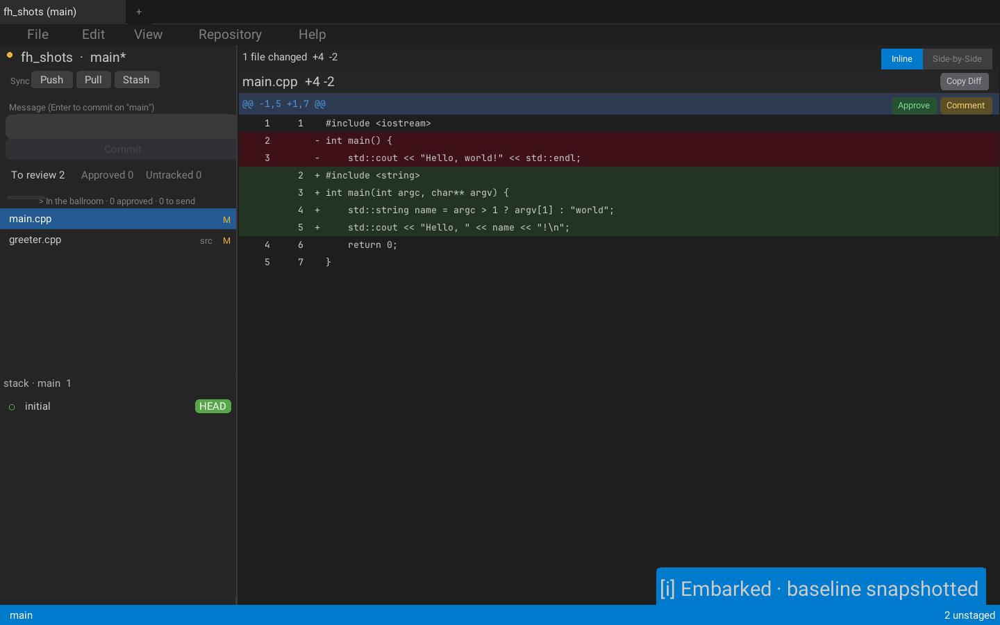
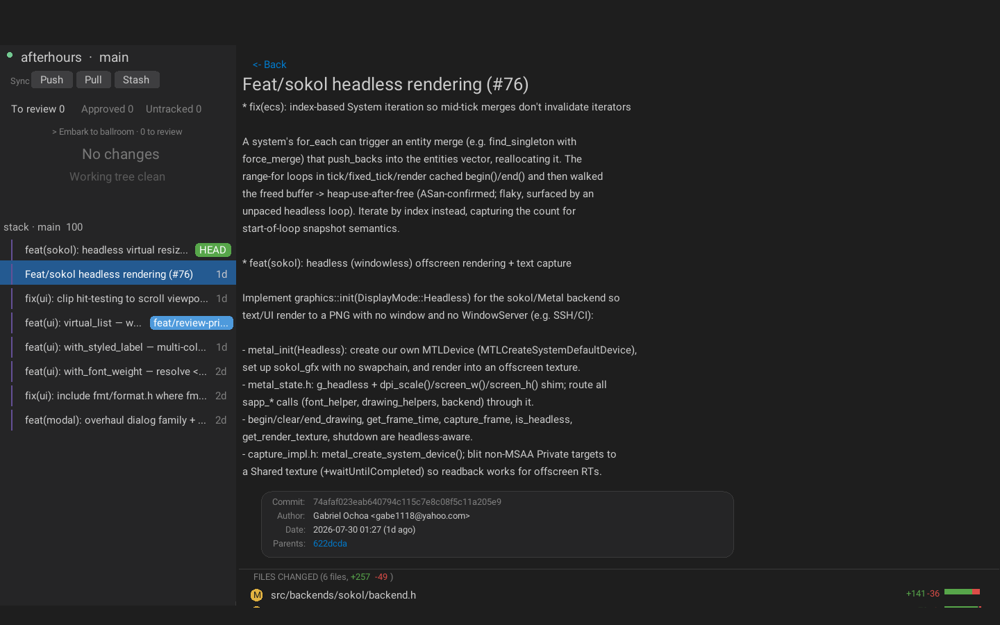
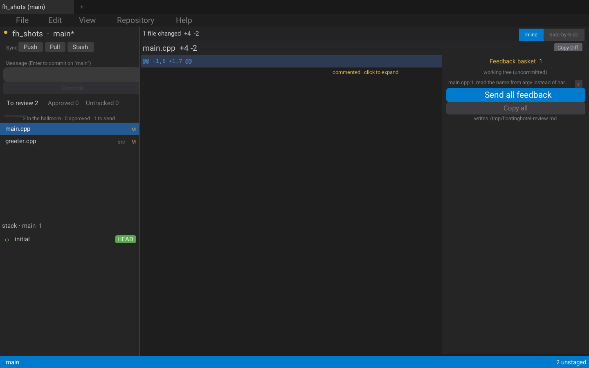

# floatinghotel

A review-first Git client for reading, reviewing, and sending feedback on agent-written code. Browse the commit stack, step through diffs, approve the good hunks, and drop comments that get bundled into a single markdown review you hand straight back to your agent.



## Features

- **Ballroom review mode** — *Embark* to start a review pass: it snapshots a baseline (so reworked files show as "new since you last looked"), then walk each hunk and **Approve** (stages it, `git add -p` style) or **Comment**.
- **Feedback basket** — comments queue up grouped by scope (working tree vs. each commit), then **Send all** (or `⌘⏎`) writes `/tmp/floatinghotel-review.md` and copies it to the clipboard, ready to paste to your agent.
- **Commit stack + detail** — browse the branch's commits with a graph rail; open any commit for its full message, metadata, changed-file list, and diff.
- **Diffs** — inline and side-by-side views, per-hunk actions, and drag-select-to-copy that includes the `file:line` location.
- **Working tree** — stage / unstage by hunk or file, commit, and Push / Pull / Stash from the sidebar.
- **Branches** — the *Refs* tab lists branches; checkout, create, and delete inline.
- **Multi-repo tabs** and a **command log** that shows every underlying `git` command it runs.
- **Keyboard-driven** — `j`/`k`/`n` move between hunks, `a` approve, `c` comment, `⌘⏎` send all, `Esc` collapse the diff shelf.
- **Headless rendering** (sokol/Metal) — render the full UI to a PNG with no window, for screenshots and CI.

## Screenshots

**Commit detail** — message, metadata, changed files, and the diff:



**Feedback basket** — queued comments grouped by scope, one keystroke from your agent:



## Build & run

macOS (sokol/Metal backend):

```sh
git submodule update --init --recursive
make
./output/floatinghotel.exe <path-to-a-git-repo>
```

## Keyboard shortcuts

| Key | Action |
| --- | --- |
| `j` / `k` / `n` | Move between hunks |
| `a` | Approve the current hunk (stage it) |
| `c` | Comment on the current hunk |
| `⌘⏎` | Send all feedback |
| `Esc` | Collapse the diff shelf |
